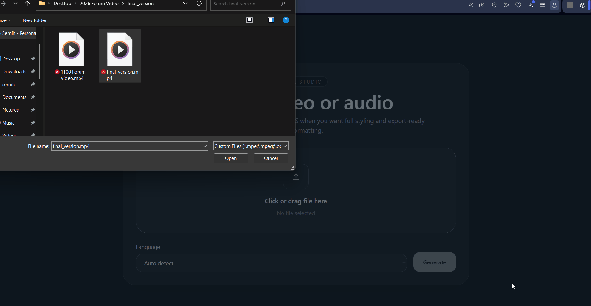

# 🎬 Subtitle Studio (VTT / ASS Generator)

A fast, minimal web app to generate, edit, and export subtitles from video/audio files.

## Demo



## ✨ Features

- 🎥 Upload video or audio files
- 🧠 Generate accurate transcripts using Whisper
- 📄 Export clean **VTT subtitles**
- ✏️ Edit subtitles directly in the browser
- 🎨 Advanced styling with **ASS format**
  - font, size, color
  - outline & shadow
  - background box & opacity
  - alignment & positioning
  - line wrapping (balanced subtitles)
- 👀 Live preview
- 💾 Download ready-to-use subtitle files

---

## 🧠 Tech Stack

- **Frontend:** React + TypeScript + Tailwind (Vite)
- **Backend:** FastAPI (Python)
- **Speech-to-Text:** Whisper (OpenAI)

---

## 📂 Project Structure

```
vtt-generator/
├── backend/
│   ├── main.py
│   ├── requirements.txt
│
├── frontend/
│   ├── src/
│   ├── package.json
│
└── README.md
```

---

## ⚙️ Installation

### 1. Clone project

```
git clone https://github.com/nowynreal/subtitle-studio.git
```

---

### 2. Backend setup

```
cd backend
python -m venv .venv
.\.venv\Scripts\activate   # Windows

pip install -r requirements.txt
```

---

### 3. Install FFmpeg (Required)

Download:
https://www.gyan.dev/ffmpeg/builds/

Add to PATH:

```
C:\ffmpeg\bin
```

---

### 4. Run backend

```
uvicorn main:app --reload --port 8000
```

---

### 5. Frontend setup

```
cd ../frontend
npm install
npm run dev
```

---

## 🧪 Usage

1. Upload a video/audio file
2. Click **Generate Subtitles**
3. Choose editor:
   - VTT (basic)
   - ASS (styled)

4. Select template (for ASS)
5. Edit subtitles directly
6. Click **Download**

---

## ⚡ Notes

- FFmpeg is required for audio processing
- CPU mode is used by default (slower but works everywhere)
- Large files may take time to process
